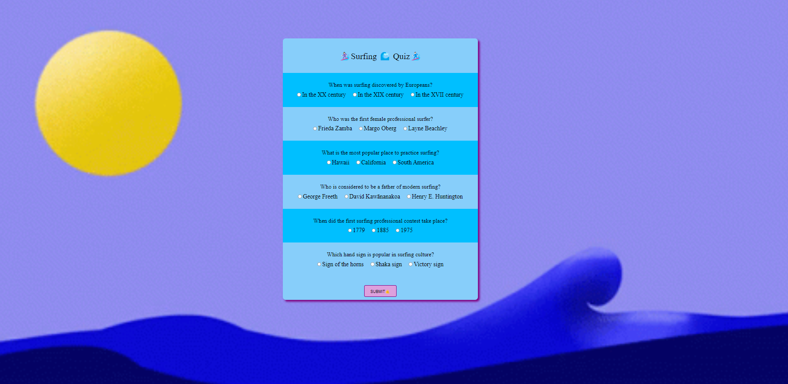
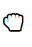
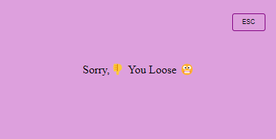
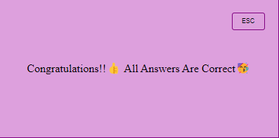
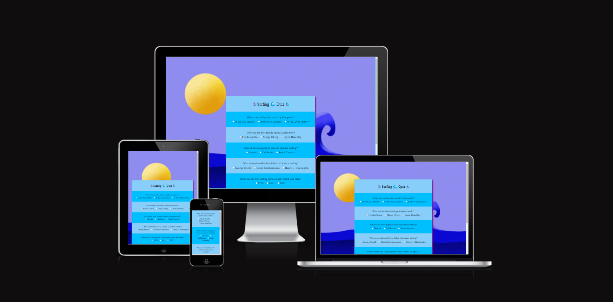
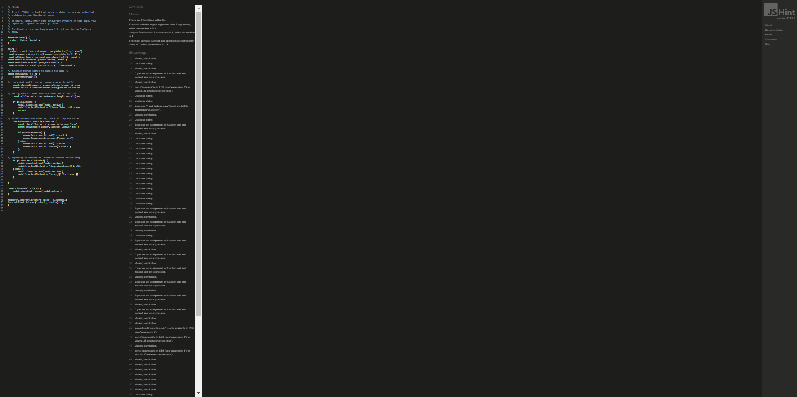

# Surfing Quiz

This is a fun Quiz for anyone who wishes to learn a bit about basic surfing knowledge or test their own.

## Features
### The Game Area
- This section will allow to pick answers by 'grab' button

### The Score Area
* Wrong Answer

* Correct Answer

* Start new game by refresh Button 

### Features Left to Implement
- I forgot place 'Try Again' option

## Testing 
[Am I Responsive](https://ui.dev/amiresponsive)

### Validator Testing 
- HTML
    - [W3C validator](https://validator.w3.org/nu/?doc=https%3A%2F%2Fmonikamula.github.io%2FProject-2-Game%2F)
    

- CSS
    - [(Jigsaw) validator](https://jigsaw.w3.org/css-validator/validator?uri=https%3A%2F%2Fmonikamula.github.io%2FProject-2-Game%2F&profile=css3svg&usermedium=all&warning=1&vextwarning=&lang=en)
    
- JavaScript
    - [Jshint validator](https://jshint.com/)
    

### Unfixed Bugs
I do have good bit to fix in JS also have forgotten add Backgroud color (CSS).
This quiz still does need more work on it... but it's was a joy to do it and even do I have mistakes in it sometimes this is way we do learn I know I would hav done few things other way.

## Languages Used
* HTML
* CSS
* JavaScript

## Deployment
- I have used Visual [Studio Code](https://code.visualstudio.com/) to create my project.
- The site was deployed to GitHub pages
My live link to [GitHub](https://monikamula.github.io/Project-2-Game/)

## Credits
- README.md Template used from Code-Institute [Code Institute](https://github.com/Code-Institute-Solutions/readme-love-maths/blob/master/README.md)

### Media

- [GIF](https://tenor.com/en-GB/search/surfing-gifs) back of the Quiz-Game is gif that I have used from 
- I have use [Favicon](https://favicon.io/favicon-generator/?t=%F0%9F%92%AF&bc=%23FFF&fc=%23FFF&b=square)

## Acknowledgements 
### I have used:
- [W3](https://www.w3schools.com/)
- [Mmdn](https://developer.mozilla.org/en-US/)
- [stackoverflow](https://stackoverflow.com/)
- [freeCodeCamp](https://www.freecodecamp.org/)
- [YouTube](https://www.youtube.com/) Tutorials
